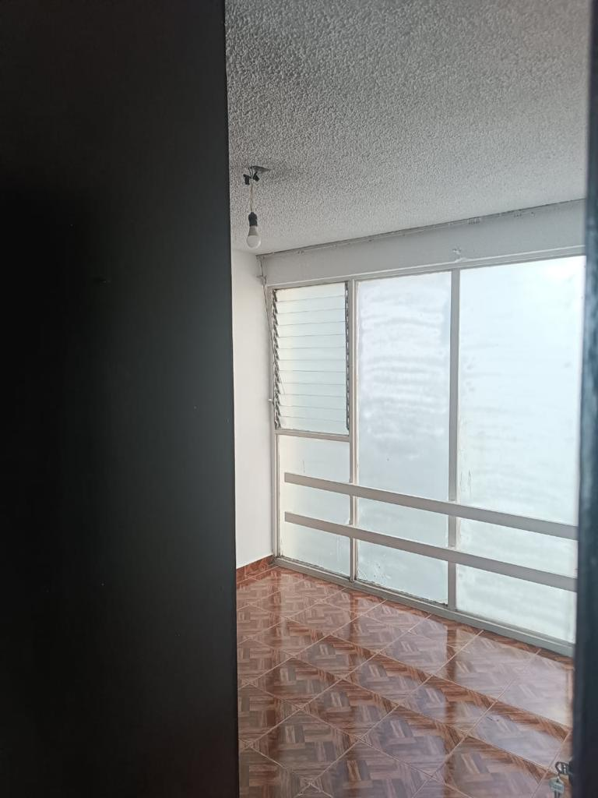

# Información sobre el departamento de Aluminio (desliza hacia abajo para ver las fotos)
 <body>
    
Caracteristicas del departamento

  </body>
<ul>
  <li> 92 m2 </li>
  <li>vista a la Calle </li>
  <li>3 recamaras</li>
  <li>baño completo</li>
  <li>sala comedor</li>
 <li>cocineta</li>
 <li>un cajón de estacionamiento </li>
</ul>

 <body>
    
REQUISITOS para la renta

  </body>
  <ul>
  <li> Aval </li>
  <li>2 depósitos </li>
  <li>renta que corre </li>
  </ul>
 <body>
    
Sin Aval 3 depósitos y renta que corre.

  </body>
  
 ## RENTA 10 mil pesos mensuales

